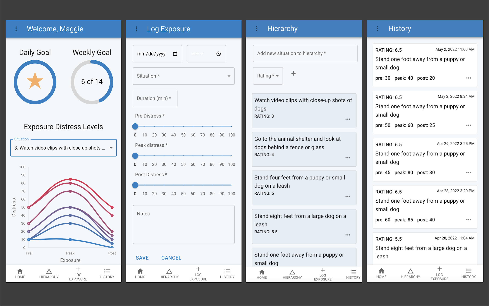

    
    
# Exposure Log

## Table of Contents

- [Description](#description)
- [Screenshots](#screenshots)
- [Built With](#built-with)
- [Getting Started](#getting-started)
  - [Prerequisites](#prerequisites)
  - [Installation](#installation)
- [Usage](#usage)
- [License](#license)
- [Acknowledgements](#acknowledgements)
- [Contacts](#contacts)

## Description

Description here ...
https://exposure-log.herokuapp.com/

## Screenshots

## Built With

## Getting Started

Getting started ....

### Prerequisites

Prerequisites go here

### Installation

Create a database named "exposure-log". Necessary queries for building the database and sample data are in the database.sql file.

Using editor of choice, from the terminal run npm install, followed by npm run server and npm run client. Project will load at url localhost:3000.

## Usage

This app relies on user generated data. To see a demo based on exposures for a fear of dogs, add sample data to database using queries from database.sql file. A demo account is also available in the deployed version using Demo Account login.  

## Acknowledgements

Thank you to Prime Academy for the opportunity ....

## Contacts

  